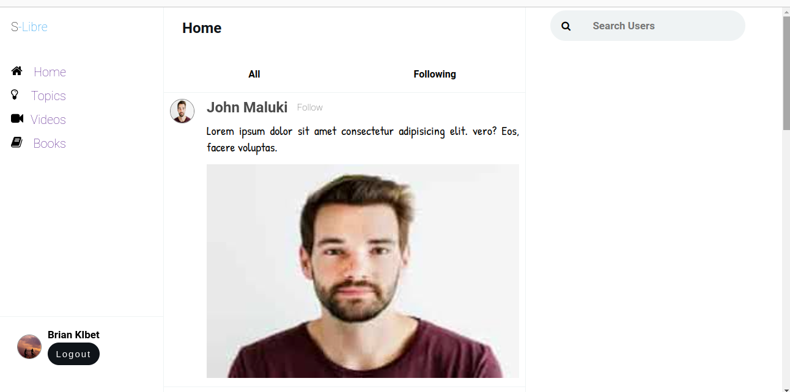
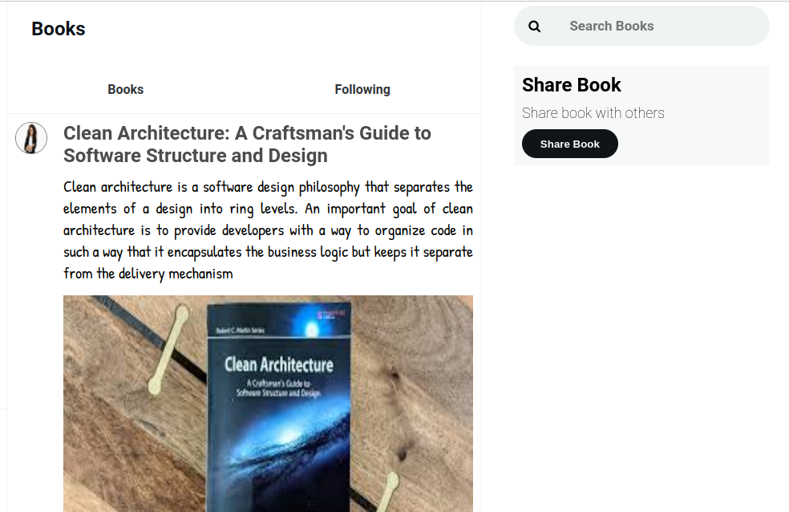
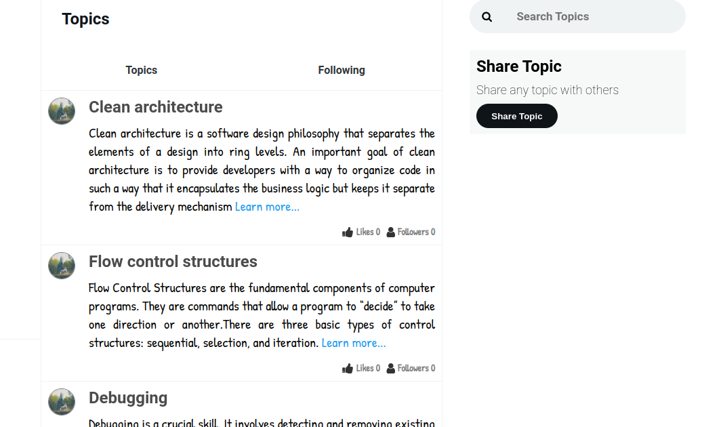
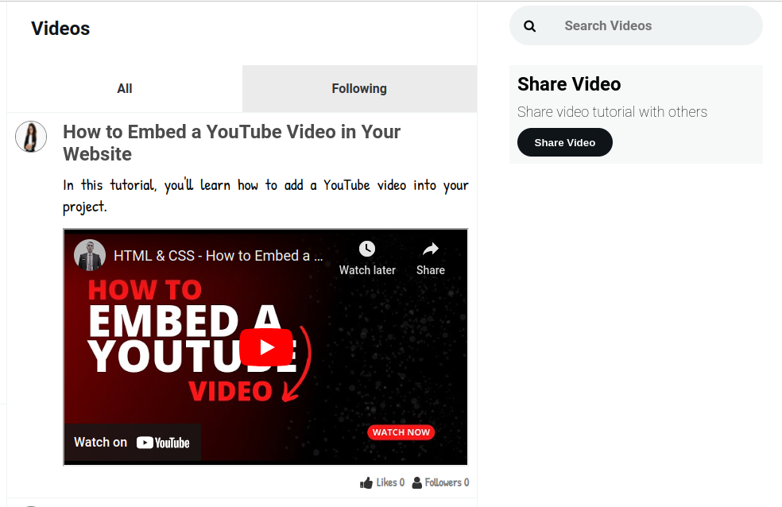

# S-LIBRE

S-Libre is a platform that allows students to create and share learning materials like technical topics and tutorial videos. Students can rate the quality of each course material to help others find high-quality resources. The materials with the highest likes are displayed first. By using S-Libre, students can help each other learn and succeed!

# Project’s Purpose or Goal

The purpose of this application, S-LIBRE, is to enable technical students to share materials such as videos, topics, and books. The applications also allow them to leave comments, like, leave a review and follow the various topics available. This will help create a sense of community to students who oftentimes do not yet have an active social network. For the students who are shy, it will also help them interact with more people thus also building their social skills and helping them get out of their comfort zone. For the students who do not have a network that matches their interest, this application will help them connect with people who share similar interests.

### Project Setup

- Clone the repository: `git clone <repository-url>`
- Navigate to cloned repository: `cd s-libre`
- Install dependencies: `npm install`
- Start the development server: `npm start`

# Technologies Used

The following have been used on this project:

- React
- CSS

## Live link to view the project View S-LIBRE

https://s-libre.netlify.app/

## Screenshots of the project

- Homepage
  
- Books
  
- Topics
  
- Videos
  

### Setup Requirements

- Git
- Web-browser or your choice
- Github
- Node.js (https://nodejs.org/)

# Known Bugs

So far so good there are no bugs related to this project 😎😎😎😎😎

## Support and contact details 🙂

To make a contribution to the code used or any suggestions you can click on the contact link and email me your suggestions.

### Email:

- tracy.kagiri@student.moringaschool.com
- frida.gathima@student.moringaschool.com
- john.maluki@student.moringaschool.com
- brian.kibet2@student.moringaschool.com
- arnold.aswani@student.moringaschool.com

## Authors

- Tracy Kagiri
- Frida Gathima
- John Maluki
- Brian Kibet
- Arnold Aswani

## License

MIT License

#Copyright (c)

Permission is hereby granted, free of charge, to any person obtaining a copy of this software and associated documentation files (the "Software"), to deal in the Software without restriction, including without limitation the rights to use, copy, modify, merge, publish, distribute, sublicense, and/or sell copies of the Software, and to permit persons to whom the Software is furnished to do so, subject to the following conditions:

The above copyright notice and this permission notice shall be included in all copies or substantial portions of the Software.

THE SOFTWARE IS PROVIDED "AS IS", WITHOUT WARRANTY OF ANY KIND, EXPRESS OR IMPLIED, INCLUDING BUT NOT LIMITED TO THE WARRANTIES OF MERCHANTABILITY, FITNESS FOR A PARTICULAR PURPOSE AND NONINFRINGEMENT. IN NO EVENT SHALL THE AUTHORS OR COPYRIGHT HOLDERS BE LIABLE FOR ANY CLAIM, DAMAGES OR OTHER LIABILITY, WHETHER IN AN ACTION OF CONTRACT, TORT OR OTHERWISE, ARISING FROM, OUT OF OR IN CONNECTION WITH THE SOFTWARE OR THE USE OR OTHER DEALINGS IN THE SOFTWARE.
